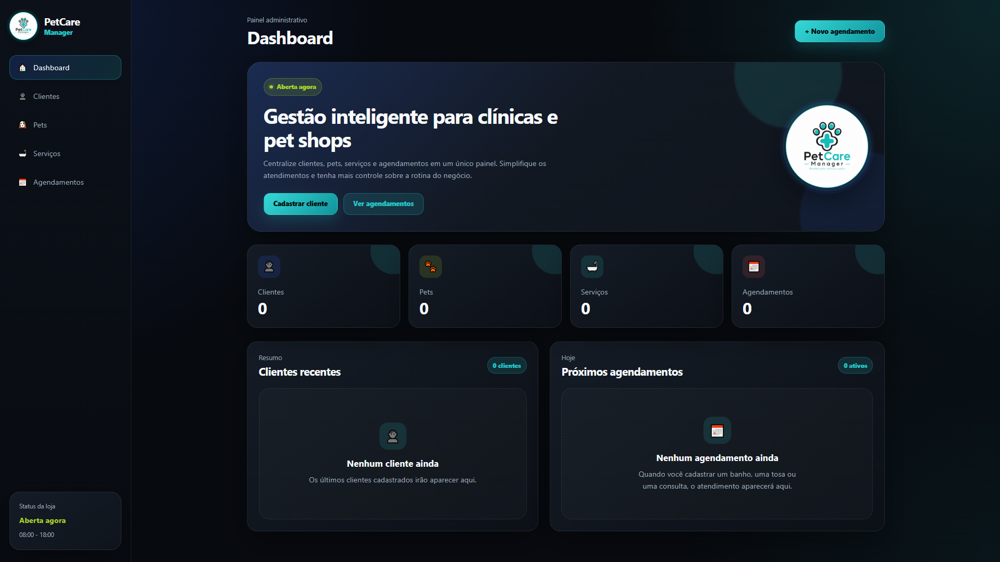
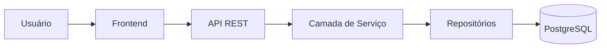
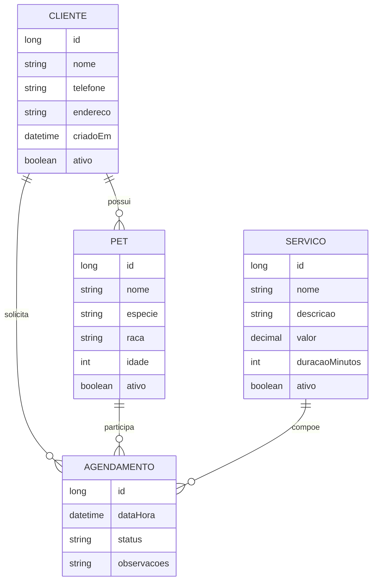

[README.md](https://github.com/user-attachments/files/29947527/README.md)
<div align="center">

# 🐾 PetCare Manager

### Gestão inteligente para clínicas veterinárias e pet shops

Sistema web em desenvolvimento para centralizar clientes, pets, serviços e agendamentos em uma única plataforma.

<br>


</div>

---

## 📌 Sobre o projeto

O **PetCare Manager** é um sistema web para gerenciamento de clínicas veterinárias e pet shops.

O projeto nasceu como uma aplicação frontend desenvolvida com **HTML, CSS e JavaScript puro**, com o objetivo de praticar lógica de programação, manipulação do DOM, formulários, validações, organização de código e persistência local.

A aplicação está evoluindo para uma solução **fullstack**, com backend em **Java e Spring Boot**, API REST e banco de dados relacional.

O desenvolvimento está sendo realizado de forma gradual, aplicando conceitos próximos de um projeto real de mercado.

---

## 🖥️ Visão geral


O dashboard apresenta uma visão centralizada da operação, incluindo:

- Total de clientes
- Total de pets
- Total de serviços
- Total de agendamentos
- Clientes cadastrados recentemente
- Próximos atendimentos
- Status de funcionamento do estabelecimento

---

## 📷 Telas do sistema

### Clientes



A área de clientes já possui estrutura para:

- Cadastro de clientes
- Listagem de registros
- Contagem de clientes cadastrados
- Exibição dos clientes recentes no dashboard
- Persistência temporária com `localStorage`

### Pets


A área de pets será responsável por:

- Cadastrar pets
- Relacionar cada pet ao seu responsável
- Editar informações
- Consultar histórico de atendimentos
- Gerenciar status do cadastro

### Serviços


O catálogo de serviços permitirá cadastrar:

- Banho
- Tosa
- Consultas
- Exames
- Procedimentos adicionais

### Agendamentos


O módulo de agendamentos será responsável por relacionar:

```text
Cliente + Pet + Serviço + Data/Horário
```

Também permitirá acompanhar e alterar o status dos atendimentos.

---

## ✨ Funcionalidades atuais

- Dashboard administrativo
- Identidade visual própria
- Menu lateral de navegação
- Navegação dinâmica entre páginas
- Destaque automático da página ativa
- Cadastro de clientes
- Listagem de clientes
- Contagem de clientes cadastrados
- Clientes recentes no dashboard
- Persistência com `localStorage`
- Estrutura inicial de pets
- Estrutura inicial de serviços
- Estrutura inicial de agendamentos
- Layout responsivo

---

## 🚧 Funcionalidades em desenvolvimento

### Clientes

- Editar dados
- Desativar clientes
- Pesquisar por nome ou telefone
- Validar duplicidade
- Integração com API

### Pets

- Cadastro completo
- Associação com responsável
- Edição e remoção
- Histórico de atendimentos
- Filtros e pesquisa

### Serviços

- Cadastro de serviços
- Definição de preço
- Definição de duração
- Ativação e desativação
- Atualização de dados

### Agendamentos

- Criação de agendamentos
- Seleção de cliente, pet e serviço
- Definição de data e horário
- Alteração de status
- Cancelamento
- Filtros por data
- Visualização dos atendimentos do dia

---

# 🏗️ Arquitetura do projeto

O projeto será dividido em dois repositórios ou módulos principais:

```text
petcare-manager/
├── petcare-frontend/
└── petcare-backend/
```

## Frontend

Responsável pela interface, experiência do usuário e interação com a API.

```text
petcare-frontend/
├── assets/
│   └── img/
├── css/
│   ├── components.css
│   ├── forms.css
│   ├── layout.css
│   └── style.css
├── js/
│   ├── agendamento.js
│   ├── app.js
│   ├── cliente.js
│   ├── pet.js
│   ├── servico.js
│   └── storage.js
├── docs/
│   └── images/
├── index.html
└── README.md
```

## Backend

O backend será desenvolvido em **Java com Spring Boot** e ficará responsável por:

- Regras de negócio
- Validação dos dados
- Persistência
- Integração com banco de dados
- Controle de usuários
- Autenticação e autorização
- Exposição de endpoints REST
- Tratamento centralizado de erros
- Documentação da API
- Testes automatizados

Estrutura planejada:

```text
petcare-backend/
├── src/
│   ├── main/
│   │   ├── java/
│   │   │   └── com/petcare/manager/
│   │   │       ├── controller/
│   │   │       ├── dto/
│   │   │       ├── entity/
│   │   │       ├── exception/
│   │   │       ├── mapper/
│   │   │       ├── repository/
│   │   │       ├── service/
│   │   │       └── config/
│   │   └── resources/
│   │       ├── application.properties
│   │       └── db/migration/
│   └── test/
├── pom.xml
└── README.md
```

---

## 🔄 Fluxo da aplicação



---

## 🧩 Entidades principais



---

## 🌐 API REST planejada

Os endpoints ainda poderão evoluir durante a implementação.

### Clientes

```http
GET    /api/clientes
GET    /api/clientes/{id}
POST   /api/clientes
PUT    /api/clientes/{id}
PATCH  /api/clientes/{id}/status
```

### Pets

```http
GET    /api/pets
GET    /api/pets/{id}
POST   /api/pets
PUT    /api/pets/{id}
PATCH  /api/pets/{id}/status
```

### Serviços

```http
GET    /api/servicos
GET    /api/servicos/{id}
POST   /api/servicos
PUT    /api/servicos/{id}
PATCH  /api/servicos/{id}/status
```

### Agendamentos

```http
GET    /api/agendamentos
GET    /api/agendamentos/{id}
POST   /api/agendamentos
PUT    /api/agendamentos/{id}
PATCH  /api/agendamentos/{id}/status
```

---

## 🛠️ Tecnologias

### Frontend

- HTML5
- CSS3
- JavaScript
- DOM
- localStorage
- Responsive Design

### Backend

- Java
- Spring Boot
- Spring Web
- Spring Data JPA
- Bean Validation
- Maven
- Lombok
- Swagger / OpenAPI

### Banco de dados

- PostgreSQL
- Flyway

### Qualidade e infraestrutura

- Git
- GitHub
- Postman ou Insomnia
- Docker
- JUnit
- Mockito

---

## ▶️ Como executar o frontend

Clone o repositório:

```bash
git clone URL_DO_REPOSITORIO_FRONTEND
```

Entre na pasta:

```bash
cd petcare-frontend
```

Abra o projeto no Visual Studio Code e execute o `index.html` utilizando a extensão **Live Server**.

Também é possível abrir o arquivo diretamente no navegador, embora o Live Server seja recomendado durante o desenvolvimento.

---

## ⚙️ Como executar o backend

> O backend ainda está em desenvolvimento. Estes passos serão utilizados após a configuração inicial do Spring Boot e do banco de dados.

Clone o repositório:

```bash
git clone URL_DO_REPOSITORIO_BACKEND
```

Entre na pasta:

```bash
cd petcare-backend
```

Configure as variáveis de ambiente:

```env
DB_URL=jdbc:postgresql://localhost:5432/petcare
DB_USERNAME=postgres
DB_PASSWORD=sua_senha
```

Execute a aplicação:

```bash
./mvnw spring-boot:run
```

No Windows:

```bash
mvnw.cmd spring-boot:run
```

A API será disponibilizada inicialmente em:

```text
http://localhost:8080
```

---

## 🧪 Testes planejados

- Testes unitários da camada de serviço
- Testes dos repositories
- Testes de integração da API
- Testes das validações
- Testes de fluxo de agendamento
- Testes de regras de disponibilidade

---

## 🗺️ Roadmap

- [x] Criar identidade visual
- [x] Estruturar o dashboard
- [x] Criar navegação entre páginas
- [x] Implementar cadastro de clientes no frontend
- [x] Persistir clientes com `localStorage`
- [ ] Implementar módulo de pets
- [ ] Implementar módulo de serviços
- [ ] Implementar módulo de agendamentos
- [ ] Criar projeto Spring Boot
- [ ] Modelar entidades do backend
- [ ] Criar banco PostgreSQL
- [ ] Implementar API REST
- [ ] Integrar frontend e backend
- [ ] Implementar autenticação
- [ ] Criar testes automatizados
- [ ] Documentar endpoints com Swagger
- [ ] Realizar deploy

---

## 📚 Aprendizados

Durante o desenvolvimento, estão sendo praticados:

- Lógica de programação
- Manipulação do DOM
- Eventos
- Arrays e objetos
- Renderização dinâmica
- Formulários e validações
- Organização modular
- Separação de responsabilidades
- Responsividade
- Padronização visual
- Modelagem de domínio
- Construção de APIs REST
- Arquitetura em camadas
- Persistência com banco relacional
- Versionamento com Git e GitHub

---

## 🎯 Objetivo profissional

O PetCare Manager está sendo desenvolvido como parte da minha evolução como desenvolvedor fullstack.

A proposta é utilizar um problema próximo de um cenário real para estudar frontend, backend, banco de dados, arquitetura, testes, documentação e deploy.

Mais do que criar uma interface, o objetivo é compreender todo o ciclo de desenvolvimento de uma aplicação.

---

## 👨‍💻 Autor

Desenvolvido por **Emanoel Cavalcante**.

[](https://github.com/EmanoelCavalcante)
[](https://www.linkedin.com/in/emanoel-cavalcante)

---

<div align="center">

### 🐾 PetCare Manager

**Gestão inteligente para clínicas e pet shops**

</div>
